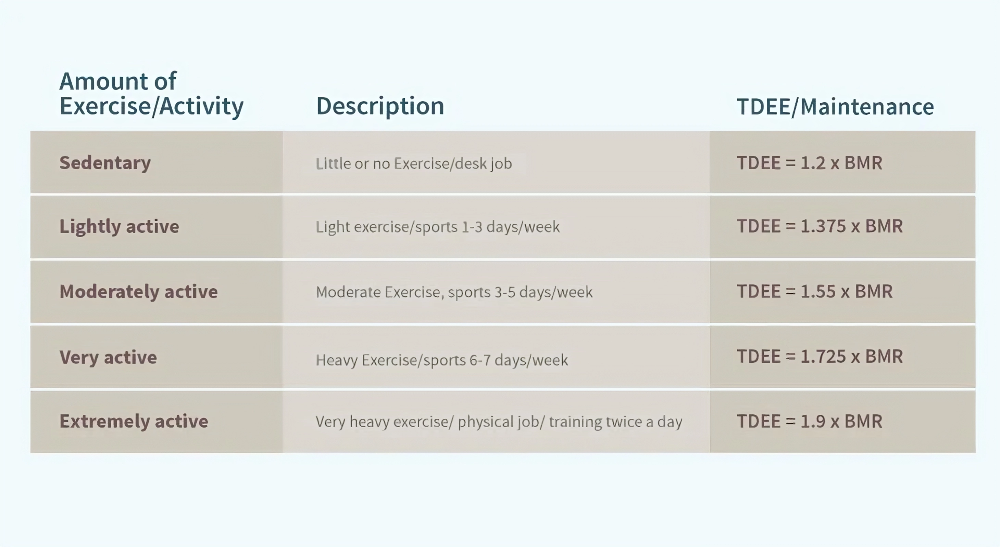

# YourDiet
#####  Tuwaiq Data Science & ML Bootcamp-Python Project 1 | This project was coded by Abdulmohsen Ali Albareed.

<p align="center">

</p>

## What is YourDiet?
**YourDiet** is a Python program that helps the user know his BMI status and how many calories he needs to maintain basic physiological functions while at rest. The program uses the basal metabolic rate (BMR) to calculate the amount of calories that the user needs based on the mathematical formula. It also uses the activity factor of the user to make the number of calories more accurate. YourDiet program can also make your life easier by calculating the calories that the user consumes from food and representing it as a table to know how many calories the user needs to achieve his goal.

## basal metabolic rate (BMR)
**BMR** represents the number of calories your body needs to maintain basic physiological functions while at rest. The formula varies for males and females:
- For males: BMR = 88.362 + (13.397 x weight in kg) + (4.799 x height in cm) - (5.677 x age in years).
- For females: BMR = 447.593 + (9.247 x weight in kg) + (3.098 x height in cm) - (4.330 x age in years).

 ## Body Mass Index (BMI)
**BMI** is a simple numerical measure used to assess whether a person has a healthy body weight in relation to their height. BMI is calculated by dividing a person's weight in kilograms by the square of their height in meters.

The formula to calculate BMI is as follows:

BMI = weight (kg) / (height (m) * height (m))

Once you calculate your BMI, it falls into one of the following categories, which can give you an indication of whether your weight is within a healthy range:

- Underweight: BMI less than 18.5
- Normal weight: BMI between 18.5 and 24.9
- Overweight: BMI between 25 and 29.9
- Obese: BMI between 30 and 34.9
- Extremely obese: BMI grater than 35

<p align="center">

</p>


## Physical Activity Level (PAL) or Activity Factor
**Physical Activity Level (PAL) or Activity Factor** is factor accounts for the calories burned through physical activity, such as exercise, sports, and daily movement. The activity level can be classified as sedentary, lightly active, moderately active, very active, or extra active, with each level having a corresponding multiplier.

<p align="center">

</p>


## Project details
In this project,I used different data types, functions, lambda function, different types of loops, and conditions to accomplish the project.
The user will enter his name, weight, height, age, gender, and activity factor. Based on these data, there are many functions that will calculate the BMR and BMI. The user can display his information with the number of calories he needs and his BMI status. The user can enter the meals that he ate during the day and display them as a table with a total of calories.

### Project features
- Calculate BMI
- Calculate BMR
- Display the personal information that was entered, calories needed, and BMI status.
- Insert a meal with its calories in the daily calories table.
- Display a daily calories table.


## Functions
### 1. calculate_BMR
- This function is used to calculate the BMR based on the weight, height, age, gender, and activity factor of the user. The function used if-clause and data from a dictionary named 'user'
  
```python
def calculate_BMR():
    BMR=0
    if(user['Gender']=='Male'):
        BMR=88.362 + (13.397 * user['Weight']) + (4.799 * user['Height']) - (5.677 *user['Age']) 
    else:
        BMR=447.593 + (9.247 * user['Weight']) + (3.098 * user['Height']) - (4.330 *user['Age'])
        
    if Activity_Factor ==1:
        BMR=BMR*1.2
    elif Activity_Factor ==2:
        BMR=BMR * 1.375
    elif Activity_Factor ==3:
        BMR=BMR*1.55
    elif Activity_Factor ==4:
        BMR=BMR*1.725
    else:
        BMR=BMR*1.9
    user.update({'Calories':BMR})

```


### 2. calculate_BMI
- This function is used to calculate the BMI based on the weight and height of the user. The function needs two parameters: weight and height.

```python
def calculate_BMI(weight,height):
    height=height/100
    BMI=weight/(height*height)
    if BMI<18.5:
        user['BMI']="Underweight"
    elif BMI>=18.5 and BMI<=24.9:
        user['BMI']='Normal weight'
    elif BMI>=25 and BMI<=29.9:
        user['BMI']='Overweight'
    elif BMI>=30 and BMI<=34.9:
        user['BMI']='Obese'
    else:
        user['BMI']='Extremely obese'
```


### 3. sum_calories
- This function is used to sum the total number of calories the user has and display it in the daily calories table.

```python
def sum_calories(list_calories):
    total_sum_calories=0
    for i in range(1,len(list_calories)):
        total_sum_calories+=list_calories[i][1]
    return total_sum_calories
````


## Main part of code
### 1.Input the user information
- This code below asks the user to enter his information and verify if the gender and activity factor are correct (male and female) for gender and (1 to 5) for activity factor.

```python
#input the User info
Name=input("Enter your Name:")
user.update({'Name':Name})

Weight=float(input("Enter your weight:"))
user.update({'Weight':Weight})

Height=float(input("Enter your Height:"))
user.update({'Height':Height})

calculate_BMI(user['Weight'],user['Height'])

Age=int(input("Enter your Age:"))
user.update({'Age':Age})

Gender=input("Enter your Gender(Male/Female):")  
user.update({'Gender':Gender})
#If the gender that was entered is not male or female, ask the user again to re-enter.
while Gender != 'Male' and Gender != 'Female':
    Gender=input("Please Enter Male or Female:")
    user.update({'Gender':Gender})
    
print("\n1.Sedentary (little to no exercise) \n2.Lightly active (light exercise/sports 1-3 days/week) \n3.Moderately active (moderate exercise/sports 3-5 days/week)\n4.Very active (hard exercise/sports 6-7 days a week)\n5.Extra active (very hard exercise/sports and physical job)")
Activity_Factor = int(input("Enter your Activity_Factor(1 for Sedentary , 2 .. ):")  )
user.update({'Activity_Factor':Activity_Factor})
calculate_BMR()

#If the activity factor that was entered ranges between 1 and 5, ask the user again to re-enter.
while Activity_Factor not in range(1,6):
    Activity_Factor=int(input("Enter your Activity_Factor Again:"))
    user.update({'Activity_Factor':Activity_Factor})
```


### 2. Show the user personal information
- This code displays the personal information of the user, including name, weight, height, age, gender, activity factor, BMI status, and calories.

```python
#show the info of the user
print('\nYour information:')
for info in user.items():
    if info[0] == 'Activity_Factor':
        print(info[0],': ',Activity_Factor_label[info[1]])
    else:
        print(info[0],': ',info[1])
```

### 3.Initialize the daily calories table.

```python
#create daily calories table as list
daily_calories = [['Meal Name','Calories Amount','Time'],['Total Amount of Calories',0,'']]
```

### 4.Add a new meal to the daily calories table

```python
#After each record is entered,delete the last total number of calories and recalculate it.
daily_calories.pop(-1)

meal_name = input('Enter the meal name:')
calories_amount= float(input('Enter the calories_amount:'))

#Add new meal to the daily calories table
add_meal=lambda meal_name,calories_amount : daily_calories.append([meal_name,calories_amount,datetime.now()]) 
add_meal(meal_name,calories_amount)

#Add the new total number of calories.
daily_calories.append(['Total Amount of Calories',sum_calories(daily_calories)])
```

### 5. Show the daily calories table
- In this code, I used tabulate-lib to display the daily calories in a table.
```python
print(tabulate(daily_calories, headers="firstrow", tablefmt="grid"))
```

## Reference
- datetime lib: https://docs.python.org/3/library/datetime.html
- tabulate lib: https://pypi.org/project/tabulate/