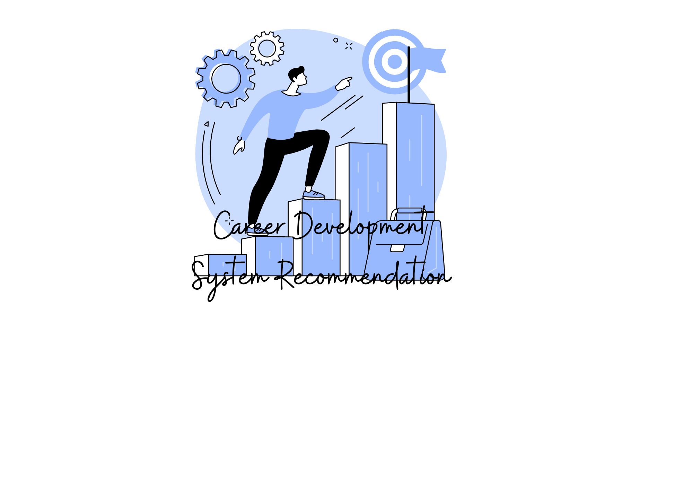

# Bootcamp-Project-1-Python
##  Career Development System Recommendation

**Overview:** A system that provides career recommendations for fresh graduates or individuals seeking a career change, based on their existing skills.

The user should be capable of doing the following:

- Entering any number of skills they want.
- Entering their Education Level.
- Viewing the top 2 Recommended Careers with Compatibility ratios.
- Viewing specialized certificates for fields that are appropriate.

### Reference:
- [Python for Data Science, AI & Development IBM ](https://www.coursera.org/learn/python-for-applied-data-science-ai)

- [Python Lambda Functions](https://www.geeksforgeeks.org/python-lambda-anonymous-functions-filter-map-reduce/)

- [Programming in AI at IAU ](https://www.iau.edu.sa/en/courses/programming-in-ai)
